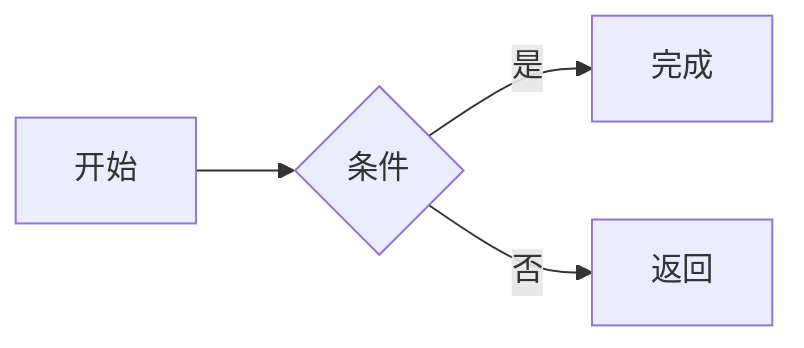

# NextMD

NextMD 是一款基于 Tauri 的桌面 Markdown 编辑器，提供所见即所得编辑、源码编辑、实时预览、Mermaid 图表和 AI 写作辅助。界面与操作方式参考 Typora，重点关注长文档编辑、结构导航和本地文件体验。

## 功能

### Markdown 编辑

- 所见即所得编辑，支持标题、粗体、斜体、删除线、引用、列表、任务列表、链接、图片和代码块。
- 基于 CodeMirror 6 的 Markdown 源码模式，提供语法高亮、行号、搜索替换和大文件虚拟滚动。
- 分栏模式同时显示 Markdown 源码和渲染结果。
- 支持中文文本紧邻 `**粗体**` 标记的解析。
- 支持查找、替换、上一处和下一处匹配。

### Mermaid

- 渲染 `mermaid` fenced code block。
- 默认折叠 Mermaid 源码，减少长图表占用的页面空间。
- 点击“编辑源码”可展开代码并直接修改图表。
- Mermaid 按需加载，避免增加编辑器首次启动负担。

示例：

````markdown

````

### 表格

- 插入和编辑 Markdown 表格。
- 拖动表头调整列顺序。
- 拖动首列单元格调整行顺序。
- 拖动单元格底部调整行高。
- 拖动列边界调整列宽。

### 文档导航

- 左侧大纲根据 Markdown 标题自动生成。
- 点击大纲标题可定位到正文位置。
- 文档滚动时自动高亮当前章节。
- 大纲宽度可拖动调整，也可拖动到边缘隐藏。

### 本地文件

- 新建、打开、保存、另存为和关闭 Markdown 文档。
- 支持拖入 `.md`、`.markdown`、`.mdx` 和 `.txt` 文件。
- 记录最近打开的文件。
- 检测磁盘中的原文件变化，并提示刷新当前文档。
- 区分加载时的格式规范化与真实编辑，状态栏显示保存状态。
- 导出为 HTML。

### 写作体验

- 纸笺、明亮、深色、护眼和跟随系统主题。
- 专注模式突出当前编辑段落。
- 打字机模式让光标保持在视口中央。
- 状态栏显示字数、行数和保存状态。

### AI 助手

AI 面板支持续写、润色、翻译、总结、多轮对话以及将生成内容插入文档。

内置以下 OpenAI 兼容服务配置：

- DeepSeek
- OpenAI / 兼容服务
- MiniMax
- Qwen
- Kimi

在状态栏点击设置图标，选择服务商并填写 API Key、API 端点、模型名称和温度。建议先使用“测试连接”确认配置有效。

> API Key 由用户自行提供。不要将真实密钥提交到代码仓库。

## 快捷键

| 快捷键 | 功能 |
| --- | --- |
| `Ctrl+N` | 新建文档 |
| `Ctrl+O` | 打开文档 |
| `Ctrl+S` | 保存 |
| `Ctrl+Shift+S` | 另存为 |
| `Ctrl+F` | 查找 |
| `Ctrl+H` | 查找和替换 |
| `F5` | 从磁盘刷新当前文档 |
| `F8` | 切换专注模式 |
| `F9` | 切换打字机模式 |

## 技术栈

| 模块 | 技术 |
| --- | --- |
| 桌面应用 | Tauri 2、Rust |
| 前端 | React 19、TypeScript、Vite 8 |
| 样式 | Tailwind CSS 4 |
| 富文本编辑 | Tiptap 3、ProseMirror |
| 源码编辑 | CodeMirror 6 |
| Markdown 预览 | react-markdown、remark-gfm |
| 图表 | Mermaid 12 |
| 状态管理 | Zustand 5 |
| AI | Vercel AI SDK、OpenAI Compatible API |

## 开发环境

需要安装：

- Node.js 20 或更高版本
- npm
- Rust stable 工具链
- Tauri 对应平台的系统依赖

Windows 桌面开发还需要 Microsoft C++ Build Tools 和 WebView2。

## 安装与运行

安装依赖：

```bash
npm install
```

仅运行 Web 前端：

```bash
npm run dev
```

开发服务器地址：

```text
http://localhost:2177
```

运行桌面应用：

```bash
npm run tauri dev
```

## 构建

构建前端：

```bash
npm run build
```

构建桌面安装包：

```bash
npm run tauri build
```

检查代码：

```bash
npm run lint
```

生成结果：

- Web 构建输出到 `dist/`。
- Rust 调试程序输出到 `src-tauri/target/debug/`。
- Tauri 安装包输出到 `src-tauri/target/release/bundle/`。

如果 Windows 提示无法删除 `src-tauri/target/debug/app.exe`，说明旧的 NextMD 调试进程仍在运行。关闭该进程后重新执行命令。

## 项目结构

```text
NextMD/
├─ src/
│  ├─ components/
│  │  ├─ ai/             AI 设置、对话和快捷操作
│  │  ├─ editor/         Tiptap、CodeMirror、预览和工具栏
│  │  └─ layout/         标题栏、菜单、大纲和状态栏
│  ├─ hooks/             文档生命周期、主题和 AI 流程
│  ├─ lib/
│  │  ├─ ai/             AI 客户端、提示词和会话逻辑
│  │  ├─ documentActions.ts
│  │  ├─ fileOps.*.ts    Web 与 Tauri 文件操作
│  │  └─ tableDrag.ts    表格拖动与尺寸调整
│  └─ stores/            编辑器、文件、主题、AI 和通知状态
├─ src-tauri/            Tauri 配置、Rust 入口、权限和应用图标
├─ package.json
└─ vite.config.ts
```

## 研发约定

- 文档的新建、打开、刷新、保存和关闭统一通过 `src/lib/documentActions.ts`。
- Markdown 正文和保存状态由 `src/stores/editorStore.ts` 管理。
- Tiptap 与 CodeMirror 通过编辑器 store 同步，不要在组件之间直接复制文档状态。
- 新增文件系统能力时，需要同时检查 Web、Tauri 实现和 `src-tauri/capabilities/` 权限。
- AI 供应商使用 OpenAI 兼容接口，网络请求逻辑放在 `src/lib/ai/`。
- Mermaid 和大型功能优先按需加载，避免增加首屏包体。

## 当前限制

- Web 模式无法直接覆盖本地原文件，保存时会触发浏览器下载。
- HTML 导出暂不自动嵌入本地图片资源。
- 部分 Tiptap 尚未支持的 Markdown 扩展语法，在所见即所得与源码模式之间切换时可能被规范化。
- AI 服务的模型名称、区域端点和可用能力由对应服务商决定，必要时请在设置中手动修改。
